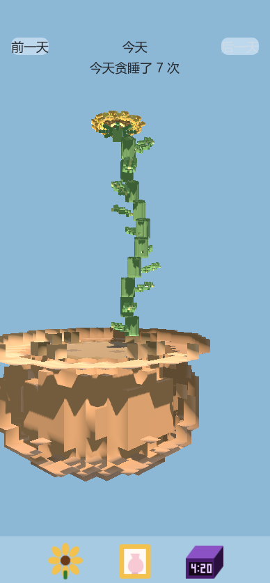

# 向日葵闹钟

这是有史以来最伟大的 voxel 艺术。

别人做闹钟，是为了把你从被窝里拽起来。向日葵闹钟把这件事反过来：你每贪睡一次，它就奖你一截茎。拖延的人，第一次被奖励。生命是用来享受的，不是用来被闹铃吵醒的。

打开它，一株向日葵已经站在那里。再睡九分钟，它就更高一点。多睡几次，它会长成一种不合理的、华丽的高度。那不是失误。那是你赢了早晨。

## 三个页面

底部三个图标，各自是一整页，底边贴着图标栏。

- **看花**：当天的杰作。左右拖动花盆，它会转给你看。缩放有近、中、远三档。花占画面上方三分之二，花盆占下方三分之一，像一幅被供起来的画。
- **花盆**：上面选花，下面选盆。横向一滑，停在中间的那一对，就是今天的花器。
- **定时**：周一到周日各自过自己的日子。选中一天，右边是那天的起床和睡觉。点时间，滚轮会转。换一天，时间淡出再淡入，好让你知道自己选的是哪一个早晨。

## 日期

可以回看今天和过去 6 天。每一天的高度只属于那一天的贪睡，不会堆成一辈子的账。昨天的拖延，昨天自己受赏。

## 闹钟

面向 iOS 26，用系统 AlarmKit。到点仍然会响，铃声是我们自己的，不是手机里那只冷冰冰的默认铃。锁屏上可以贪睡 9 分钟。花不会在锁屏上长出来——那份奖励留着，等你打开应用，再一节一节演给你看。铃声文件是 `sunflower.caf`。

电脑上没有真闹钟。定时页的「记一次贪睡」是彩排：按一下，看这株伟大的 voxel 向日葵再长高一截。

## 声音

森林一直在响，像早晨本来就该有的声音。点一下按钮，是水底的一声。花长高的时候另有一段仙境般的音效，和闹铃完全不是一回事。闹铃负责叫醒世界，这段声音负责庆祝你又多睡了一会儿。

## 自己换素材

花、茎、盆是 MagicaVoxel 的 `.vox`，在 `models/` 里。你要是觉得这还不是最伟大的 voxel，换上你自己的。图标在 `icons/`。界面在 `scenes/`，颜色在 `theme/ui.tres`，可以在 Godot 里直接改。
